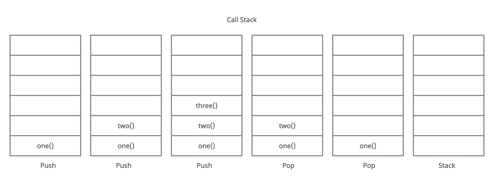

# Class 10

[Home](https://markjackson28.github.io/reading-notes/)

## Summary/Notes of readings 

[Understanding the JavaScript Call Stack](https://www.freecodecamp.org/news/understanding-the-javascript-call-stack-861e41ae61d4/)

*What is a ‘call’?*

- Invoking a function.

*How many ‘calls’ can happen at once?*

- Technically one.

*What does LIFO mean?*

- ‘Last In, First Out’

*Draw an example of a call stack and the functions that would need to be invoked to generate that call stack.*

```
function one(){
 two();
}
function two() {
 three();
}
function three() {
 console.trace(“Call Stack”);
}
one();
```
> 
- [Functions/Photo Credit medium.com](https://medium.com/swlh/in-depth-introduction-to-call-stack-in-javascript-a07b8513bcc3)

*What causes a Stack Overflow?*

- ‘A stack overflow occurs when there is a recursive function (a function that calls itself) without an exit point. The browser (hosting environment) has a maximum stack call that it can accommodate before throwing a stack error.’

[JavaScript error messages](https://codeburst.io/javascript-error-messages-debugging-d23f84f0ae7c)

*What is a ‘reference error’?*

- ‘When you try to use a variable that is not yet declared.’

*What is a ‘syntax error’?*

- ‘When you have something that cannot be parsed in terms of syntax.’

*What is a ‘range error’?*

- When you try to manipulate an object with an invalid length.

*What is a ‘type error’?*

- When the ‘type’ of variable is incompatible.

*What is a breakpoint?*

- Where you want to stop running the code if a line/condition is met.

*What does the word ‘debugger’ do in your code?*

- A statement you want to be met in the breakpoint.

## Things I want to know more about

 - Breakpoints and Debugger.
